# E-commerce Transaction Processing System

A real-time transaction processing system built with Spring Boot, Apache Kafka, and PostgreSQL. The system demonstrates a microservices architecture for handling e-commerce transactions with high throughput and reliability.

## System Architecture

The system consists of two microservices:
- `transaction-generator`: Generates simulated transaction events at regular intervals
- `transaction-processor`: Consumes transactions from Kafka, processes them, and persists to PostgreSQL

### System Flow

#### 1. Transaction Generation Flow

```mermaid
flowchart LR
    subgraph TG["Transaction Generator Service"]
        direction TB
        A[("⏰ Scheduler")]
        B["🔄 TransactionGenerator"]
        C["📝 Transaction Builder"]
        D["📤 Kafka Producer"]
        
        A -->|"@Scheduled"| B
        B -->|"generate()"| C
        C -->|"build()"| D
    end

    subgraph KF["Apache Kafka"]
        direction TB
        E["📫 transactions topic"]
    end

    D -->|"send()"| E

    %% Styling
    classDef scheduler fill:#ffcdd2,stroke:#c62828
    classDef generator fill:#e1f5fe,stroke:#0288d1
    classDef builder fill:#e8f5e9,stroke:#2e7d32
    classDef producer fill:#fff3e0,stroke:#ef6c00
    classDef kafka fill:#e3f2fd,stroke:#1565c0
    
    class A scheduler
    class B generator
    class C builder
    class D producer
    class E kafka
    class TG generator
    class KF kafka
```



#### 2. Transaction Processing Flow

```mermaid
flowchart LR
    subgraph KF["Apache Kafka"]
        direction TB
        E["📫 transactions topic"]
    end

    subgraph TP["Transaction Processor Service"]
        direction TB
        F["📥 Kafka Consumer"]
        G["🔄 TransactionConsumer"]
        H["💾 JPA Repository"]
    end

    subgraph DB["PostgreSQL Database"]
        direction TB
        I[("🗄️ transactions")]
    end

    E -->|"consume()"| F
    F -->|"@KafkaListener"| G
    G -->|"save()"| H
    H -->|"persist()"| I

    %% Styling
    classDef kafka fill:#e3f2fd,stroke:#1565c0
    classDef consumer fill:#fff3e0,stroke:#ef6c00
    classDef processor fill:#e1f5fe,stroke:#0288d1
    classDef repository fill:#e8f5e9,stroke:#2e7d32
    classDef database fill:#f3e5f5,stroke:#4a148c

    class E kafka
    class F consumer
    class G processor
    class H repository
    class I database
    class KF kafka
    class TP processor
    class DB database
```



#### 3. Data Model


#### 4. Error Handling & Monitoring

```mermaid
flowchart TB
    subgraph EH["Error Handling"]
        direction TB
        A["❌ Exception Handler"]
        B["🔄 Retry Policy"]
        C["📝 Error Logger"]
        
        A -->|"handle"| B
        A -->|"log"| C
        B -->|"retry"| A
    end

    subgraph MT["Monitoring"]
        direction TB
        D["📊 Metrics Collector"]
        E["📈 Performance Monitor"]
        F["🔍 Health Check"]
        
        D --> E
        D --> F
    end

    %% Styling
    classDef error fill:#ffcdd2,stroke:#c62828
    classDef retry fill:#fff3e0,stroke:#ef6c00
    classDef logger fill:#e1f5fe,stroke:#0288d1
    classDef metrics fill:#e8f5e9,stroke:#2e7d32
    classDef monitor fill:#f3e5f5,stroke:#7b1fa2
    classDef health fill:#fff3e0,stroke:#ef6c00

    class A error
    class B retry
    class C logger
    class D metrics
    class E monitor
    class F health
    class EH error
    class MT metrics
```



### Key Features
- Real-time transaction processing
- Scalable message-driven architecture
- Persistent storage with PostgreSQL
- Comprehensive transaction data model
- Robust error handling and logging
- Production-ready configuration

## Prerequisites

- Java 17 or higher
- Maven 3.6+
- Docker and Docker Compose
- 4GB+ RAM for running all services

## Project Structure

```
.
├── transaction-generator/    # Transaction generation service
│   ├── src/
│   ├── pom.xml
│   └── application.yml      # Service configuration
├── transaction-processor/    # Transaction processing service
│   ├── src/
│   ├── pom.xml
│   └── application.yml      # Service configuration
└── docker-compose.yml       # Infrastructure services
```

## Quick Start

### 1. Start Infrastructure Services

```bash
docker-compose up -d
```

This starts:
- Kafka (accessible at localhost:9092)
- PostgreSQL (accessible at localhost:5432)

### 2. Build Applications

```bash
# Build both applications
cd transaction-generator && mvn clean package -DskipTests && cd ..
cd transaction-processor && mvn clean package -DskipTests && cd ..
```

### 3. Start Services

Start the processor first:
```bash
java -jar transaction-processor/target/transaction-processor-1.0-SNAPSHOT.jar &
```

Then start the generator:
```bash
java -jar transaction-generator/target/transaction-generator-1.0-SNAPSHOT.jar &
```

## Monitoring

### View Transactions in Database

```bash
docker exec -it javaproject-postgres-1 psql -U postgres -d ecommerce -c \
"SELECT id, transaction_id, customer_id, amount, currency, payment_method, status, \
to_timestamp(timestamp/1000) as transaction_time \
FROM transactions ORDER BY id DESC LIMIT 5;"
```

Sample output:
```
 id | transaction_id                           | customer_id | amount  | currency | payment_method | status
----+----------------------------------------+-------------+---------+----------+----------------+--------
 123 | 13872a33-d1f4-4145-a997-d68ba2db36ea  | CUST-999   | 825.47  | INR      | DEBIT_CARD    | PENDING
 122 | 6445887a-6b1f-4677-9580-66af6358508b  | CUST-277   | 248.62  | EUR      | CREDIT_CARD   | PENDING
 121 | 1c0ae64c-a914-4376-8039-9b1e840638b3  | CUST-671   | 192.84  | GBP      | UPI           | PENDING
```

### Transaction Data Model

Each transaction includes:
- Unique transaction ID (UUID)
- Order ID (UUID)
- Customer ID (format: CUST-XXX)
- Amount (double precision)
- Currency (USD, EUR, GBP, INR)
- Payment Method (CREDIT_CARD, DEBIT_CARD, UPI, NET_BANKING)
- Status (PENDING, PROCESSING, COMPLETED, FAILED)
- Timestamp (epoch milliseconds)
- Description

## Configuration Details

### Kafka Configuration
- Bootstrap Servers: localhost:9092
- Topic: transactions
- Consumer Group: transaction-processor-group
- Auto Offset Reset: earliest
- Concurrency: 1

### PostgreSQL Configuration
- Database: ecommerce
- Username: postgres
- Password: postgres
- Host: localhost
- Port: 5432

### Application Ports
- Transaction Generator: 8081
- Transaction Processor: 8082

## Troubleshooting

### Common Issues

1. Port Conflicts
   - Check if ports 8081, 8082, 9092, or 5432 are already in use
   - Use `lsof -i :<port>` to identify processes
   - Kill conflicting processes or change ports in application.yml

2. Kafka Connection Issues
   - Verify Kafka is running: `docker ps | grep kafka`
   - Check Kafka logs: `docker logs javaproject-kafka-1`
   - Ensure bootstrap servers are correctly configured
   - Check network connectivity to Kafka container

3. Database Issues
   - Verify PostgreSQL is running: `docker ps | grep postgres`
   - Check database logs: `docker logs javaproject-postgres-1`
   - Ensure database exists: `psql -U postgres -l`
   - Check connection parameters in application.yml

### Logging

Both services use SLF4J with Logback for logging:
- Transaction details
- Processing status
- Error conditions
- Performance metrics

## Performance Considerations

The system is configured for development use. For production:
- Adjust Kafka partitions for higher throughput
- Configure appropriate transaction generation rate
- Tune database connection pool
- Enable database indexing for high-volume queries
- Configure appropriate JVM memory settings

## Shutdown

To stop the services:
```bash
# Stop Java applications
pkill -f transaction-processor
pkill -f transaction-generator

# Stop infrastructure services
docker-compose down
``` 